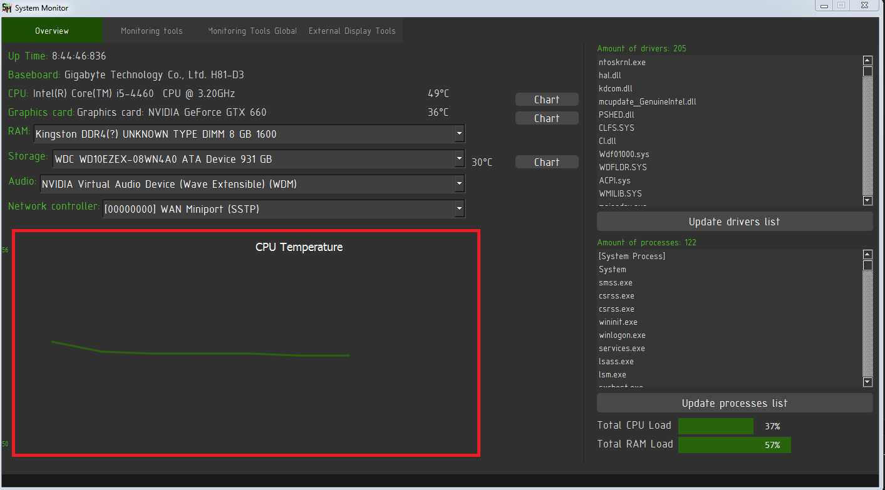
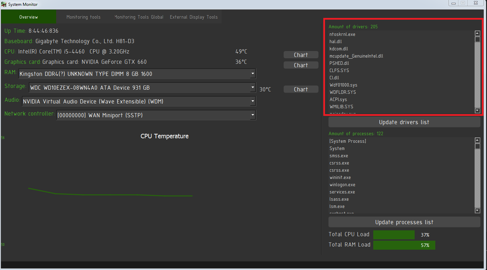

# System-Monitor
Utility that allows to monitor system and hardware information, such as temperatuge, CPU usage and so on

#### На данный момент проэкт находится на стадии разработки

### Краткое описание проекта
Проект являет собой ПО позволяющее отслеживать состояние ресурсов компьютера. ПО состоит из трех частей - две программные и одна аппаратная.
1) Первая часть: основная программа(описаная в этом репозитории).
2) Вторая часть: прошивка для Arduino(//ссылка на репозиторий).
3) Третья часть: дисплей IIC I2C для arduino, 4-контактный, 0.96 дюйм, дисплей 1602 с интерфейсной шиной IIC/I2C, Arduino Uno/Arduino Nano

### Основная программа System Monitor
Основная программа состоит из 4-х владок:
1) Overview
2) Monitoring tools
3) Monitoring tool global
4) External display tools

Рассмотрим их подробней

#### Вкладка Overview

Вкладка Overview содержит в себе информацию о времени с момента запуска системы (Up Time) на Рис. 1.1, информацию про апаратные составляющие компьютера на котором была запущенна программа, а именно название, модель и температуру материнской платы, ЦП, видеокарты, ОЗУ, хранилища, аудио адаптера, привода оптических дисков, сетевого контролера. При достижении температуры любого из устройств до критической отметки программа будет отправлять пользователю сообщение об этом.

 
  Рис. 1.1 Список названия оборудования и его температура

Ниже расположен график, который выводит информацию  о температуре выбраного устройства в реальном времени. (рис. 1.1). График отображается для выбраного пользователем устройства (выбор производится нажатием на необходимое устройство из списка на рис. 1.1)

 
  Рис. 1.2 График изменения температуры для выбраного устройства

В правой части вкладки расположена информация о текущих драйверах для устройств, в виде: устройство - драйвер.

  Рис. 1.3 Информаиця о драйверах устройств

Ниже расположен список имен текущих процессов.

 
  Рис. 1.4 Список текущих процессов

Еще ниже отображается загрузка ЦП и ОЗУ на данный момент.

 
  Рис. 1.5 Текущая нагрузка ЦП и ОЗУ

#### Вкладка Monitoring tools

Данная вкладка позволяет отслеживать нагрузку на ЦП и ОЗУ создаваемую процессами. Пользователь задает допустимую нагрузку для ЦП (в процентах) или/и для ОЗУ (в килобайтах), так же для нагрузки на ОЗУ можно выбрать отслеживание по приватному набору или по рабочему набору. Есть два типа выдачи информации про превышение нагрузки: <i>сообщение</i>, при котором при превышении допустимой нагрузки пользователю выдается сообщение в виде дата, время, процесс который вызвал нагрузку, нагрузка, после выдачи сообщения процесс мониторинга останавливается и при необходимости его нужно запускать снова, это сделано для того что-бы не заспамить пользователя однообразными сообщениями; лог - при выборе этого типа вывода информации создается файл(имя может задать пользователь иначе будет использоваться стандартное имя - дата время создания файла и идентификатор того, что программа будет мониторить - ЦП или ОЗУ, то есть стандартное имя файла будет например таким: "Thu Jan 14 18.27.16 2021_RAM"), при превышении допустимого значения нагрузки в файл будет записано информация в таком же виде как и при выборе вывода сообщением, процесс логирования не будет остановлен пока пользователь не прекратит его. 

Пользователь может добавить процессы которые будут игнорироваться, то есть, если процесс А превышает нагрузку, но он добавлен в список игнорирования, то пользователь не получит сообщения о превышении нагрузки процессом А.

Рассмотрим интерфейс

В верхней части окна расположены инструменты мониторинга ЦП:

 
  Рис. 2.1 Интерфейс вкладки Monitoring tools, инструменты мониторинга ЦП

Рассмотрим инструменты мониторинга ЦП. Для начала работы необходимо поставить галочку около Monitor processes(CPU Load) (Рис. 2.1), после чего станет активным поле ввода допустимой нагрузки, выбор файлов для игнорирования и подсказка.

 
  Рис. 2.2 Инструменты мониторинга ЦП в активном состоянии

Введем допустимую нагрузку в 40 процентов и запустим программа нажав кнопку <i>Apply</i>
  

 
  Рис. 2.3 Запуск мониторинга ЦП

Теперь создадим нагрузку на ЦП сторонней программой и посмотрим на результат работы программы.

 
  Рис. 2.4 Результат мониторинга ЦП

Как видим программа сообщает пользователю о прекращении мониторинга сменив метку "Monitoring..." (Рис. 2.3) на "Stop". Так же видим сообщение с текстом сообщающим время, название процесса и нагрузку создаваемую процессом. Так же видим, что теперь активна кнопка <i>Reset</i>, нажав на нее получим исходный вид окна:

 
  Рис. 2.5 Окно после нажатия кнопки Reset

Теперь выберем другой тип вывода информации на лог, так же укажем имя файла как helloGitHub:

 
  Рис. 2.6 Тип вывода Log

После нажатия кнопки <i>Apply</i> проверим папку с программой:
  

 
  Рис. 2.7 Созданый файл с именем helloGitHub

Как видим был создан файл с именем helloGitHub_CPU (идентификатор CPU, говорит о том, что это лог мониторинга ЦП). Теперь остановим процесс мониторинга нажатием на кнопку <i>Stop</i>:

 
  Рис. 2.8 Остановка процесса мониторинга

Как видим имеем такую же смену метки "Monitoring" на метку "Stop", говорящую об остановке процесса мониторинга. Теперь проверим сам лог:

 
  Рис. 2.9 Созданый ранее лог

Все сообщения о превышении нагрузки были зафиксированы.

Теперь добавим в игнорируемые процессы какой-нибудь процесс. Это делается выбором .ехе файла необходимой программы. Для этого необходимо нажать на кнопку <i>...</i> и выбрать нужный файл. Сделаем это:

 
  Рис. 2.10 Открытие древа каталогов по нажатию на кнопку <i>...</i>

Выбираем необходимый файл, для примера выберем aida64.ехе:

 
  Рис. 2.11 Выбираем необходимый файл

Теперь проверим главное окно прогрммы:

 
  Рис. 2.12 Окно программы после выбора игнорируемого процесса

Как видим процесс был добавлен в список игнорируемых процессов, теперь в случае, если aida64 будет создавать нугрузку выше приемлемой, то это проигнорируется прогрмаммой.

С мониторингом ОЗУ всё то же самое, за исключением того, что допустимая нагрузка задается в килобайтах и можно выбрать мониторинг по рабочему надору или по приватному набору. Попробуем найти процесс который дает нагрузку более 100000 килобайт:

 
  Рис. 2.13 Запуск мониторинга ОЗУ

В результате получаем сообщение о процессе explorer.exe, который превысил допустимое значение занимаемой ОЗУ:

 
  Рис. 2.14 Результат мониторинга ОЗУ

В остальном мониторинг ОЗУ ничем не отличается от мониторинга ЦП, то есть весь функционал приведенный выше точно так же работает для мониторинга ОЗУ.

#### Вкладка Monitoring tools global

На этой вкладке пользователь имеет возможность мониторить процент нагрузки на ЦП и ОЗУ не привязываясь к конкретным процессам. Прогрмма будет выдавать сообщение(или писать в лог), если общая нагрузка на ЦП или ОЗУ будет превышать рарещенную пользователем. 

Рассмотрим интерфейс:

 
  Рис. 3.1 Результат мониторинга ОЗУ

Как видим здесь все подобно к предыдущей вкладки, внешне отличия можно увидеть лишь в том, что для ОЗУ нагрузка задается в процентах, а не в килобайтах.
